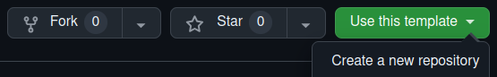
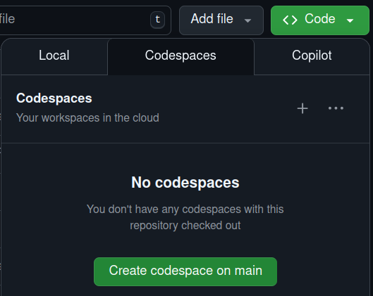

# Template não oficial para teses e dissertações no IAG

Este template foi criado com o intuíto de ajudar todos que estejam nos passos finais de seus mestrados e doutorados. Sabemos que essa é uma época caótica e a falta de informações (ou de tempo para procurá-las) só causa mais estresse, e quanto menos estresse nessa época, melhor.

Este repositório contém uma versão do Tex já configurada, usando a última versão do Texlive, a mesma versão que o Overleaf usa, baseado no trabalho de Sanjib Kumar Sen, chamado [WebLaTeX](https://github.com/sanjib-sen/WebLaTex). Todos os detalhes estão descritos lá, mas eu deixo aqui as instruções para você usar esse template.

# Como usar o template?
Você pode usar este template através do GitHub e VSCode ou pelo Overleaf mesmo. Para usar no Overleaf é só baixar este repositório como um zip e abrir como um projeto novo, que deve funcionar.

Caso você queira usar o Github, o primeiro passo é clonar o repositório para a sua conta. Para fazer isso você deve clicar em "Use this template" no canto superior direito e depois ir em "Create a new repository". Lembre-se de deixar o repositório privado! Depois disso é só escolher se você quer deixar no próprio GitHub ou baixar para o seu computador.

  

## Usando Codespaces no Github
Nesse caso você estaria usando uma máquina virtual do Github, tendo um limite de horas de uso (180 horas por mês). Para usar esse template com Codespaces é simples, basta ir no botão "Code" no canto superior direito, depois ir na aba "Codespaces" e, então, selecionar "Create codespace on main". Ele criará a máquina virtual e abrirá um editor online do VSCode. A primeira vez que você faz esse processo é um pouco demorado pois o Latex está sendo instalado, mas isso ocorre apenas na primeira abertura.

  

## Baixando o repositório no seu computador
Este é o caminho que eu recomendo, pois você não fica limitado às horas que o Github dá. Nesse caso você precisa instalar o [VSCode](https://code.visualstudio.com/). Com o editor instalado, você deve usar a opção "Clone Github repository", que aparece na página de boas vindas. Feito isso, selecione o repositório para o qual você clonou este template e depois escolha a pasta de destino (onde o seu repositório ficará salvo no seu computador).

Com a pasta escolhida, o VSCode irá baixar o repositório para o seu computador e, como existe um arquivo devcontainer.json, ele perguntará se você quer reabrir o documento com o container. Diga sim e ele fará a instalação do Latex, deixando tudo pronto para você usar. Como isso tudo acontece dentro do container, não são feitas modificações no seu computador, então não precisa se preocupar com incompatibilidades!

Caso você não tenha uma opção de clonar o repositório ou o VSCode não te perguntar sobre reabrir o documento com o container, baixe as extensões "Git" e "Docker".

# Mudando as configurações padrão do template
Se você abriu o repositório usando o Github, você tem a opção de alterar algumas configurações, que estão no arquivo '.devcontainer/devcontainer.json'. Toda vez que você fizer uma modificação e salvar o arquivo, o VSCode irá perguntar se você quer reconstruir o container, diga "sim" e as mudanças serão aplicadas. As configurações estão comentadas dentro do arquivo, então fica mais fácil você fazer suas modificações se achar necessário.

